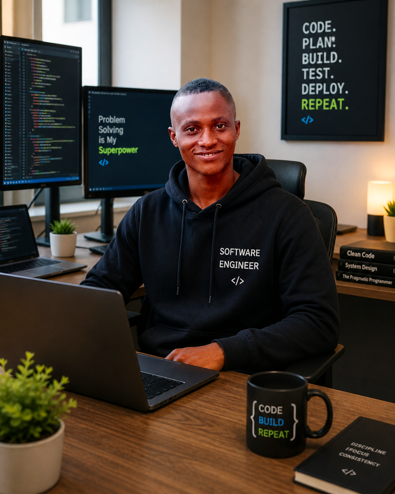

<!DOCTYPE html>
<html lang="en">
<head>
<meta charset="UTF-8">
<meta name="viewport" content="width=device-width, initial-scale=1.0">
<title>Abba James | Portfolio</title>

</head>
<body>

<!-- NAVBAR -->
<header>
    <h1>ABBA JAMES</h1>
    <nav>
        <a href="#about">About</a>
        <a href="#experience">Experience</a>
        <a href="#education">Education</a>
        <a href="#skills">Skills</a>
        <a href="#gallery">Gallery</a>
        <a href="#contact">Contact</a>
    </nav>
</header>

<!-- HERO -->
<section class="hero">
    <h2>UI/UX Designer & Developer</h2>
    
Creating intuitive and visually appealing digital experiences

    <button onclick="scrollToSection('contact')">Hire Me</button>
</section>

<!-- ABOUT -->
<section id="about">
    <h2>About Me</h2>
    

        I am a passionate UI/UX designer and junior developer with strong interest in
        building user-friendly and visually appealing digital products.
    

</section>

<!-- EXPERIENCE -->
<section id="experience">
    <h2>Experience</h2>

    

        <h3>Product Designer (UI/UX)</h3>
        
Pej Technical Complex LTD (2024 - Present)

    

    

        <h3>Data Processor</h3>
        
Pej Technical Complex LTD (2022 - 2023)

    

</section>

<!-- EDUCATION -->
<section id="education">
    <h2>Education</h2>

    

        
<strong>University of Nigeria, Nsukka</strong>

        
BSc Computer Science (In View)

    

    

        
<strong>New Vision Institute of Technology</strong>

        
Diploma in Data Processing

    

    

        
<strong>Wesley High School</strong>

        
WAEC / NECO

    

</section>

<!-- SKILLS -->
<section id="skills">
    <h2>Skills</h2>

    

        
UI/UX Design

        

    

    

        
Frontend Development

        

    

    

        
Project Management

        

    

</section>

<!-- GALLERY -->
<section id="gallery">
    <h2>Gallery</h2>
    

        
        
        
        
        
    

</section>

<!-- CONTACT -->
<section id="contact">
    <h2>Contact</h2>
    
📞 +234 816 820 4205

    
📧 jamesabba2030@gmail.com

    <button onclick="showMessage()">Send Message</button>
</section>

<footer>
    
© 2026 Abba James

</footer>

</body>
</html>
